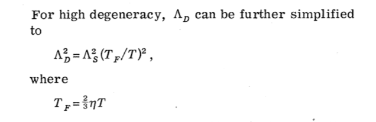

# Michigan State University Plasma Properties Database

This repo contains various forms of data that characterize the physical properties of dense plasmas. The data sources are from computational results. 

The current data was generated by our group or digitized from published results; see the readme in each folder to learn more.

Jump to [here](database/) to access the data!

